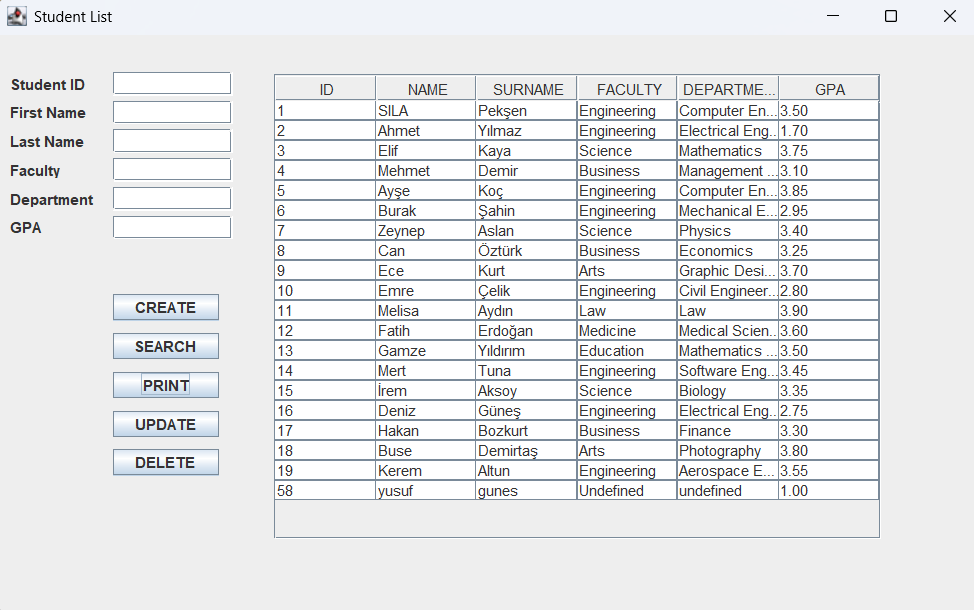

# Simple Student Management System


This is a basic Java Swing-based desktop application for managing student information in MySQL database with connection between them. Users can add, search, update, and delete student records. All data is displayed in a table interface, and includes fields such as name, faculty, department, and GPA.

## Features

- Add new students
- Search existing records
- Update and delete student entries
- Display all data in a JTable
- Delete specific student

## Technologies

- Java
- Swing GUI (JTable, JButton, JTextField, etc.)
- Object-Oriented Programming principles
- MySQL

## How to Run

1. Clone the repository:
   ```bash
   git clone https://github.com/silapeksen/simple-student-management-system.git
   ```
2. Open the project in an IDE like IntelliJ IDEA or Eclipse.
3. Navigate to `MainPage.java` and run the application.

## Notes

- This project is for educational/demo purposes.

## Contact

If you have any questions or suggestions, feel free to open an issue or reach out.
